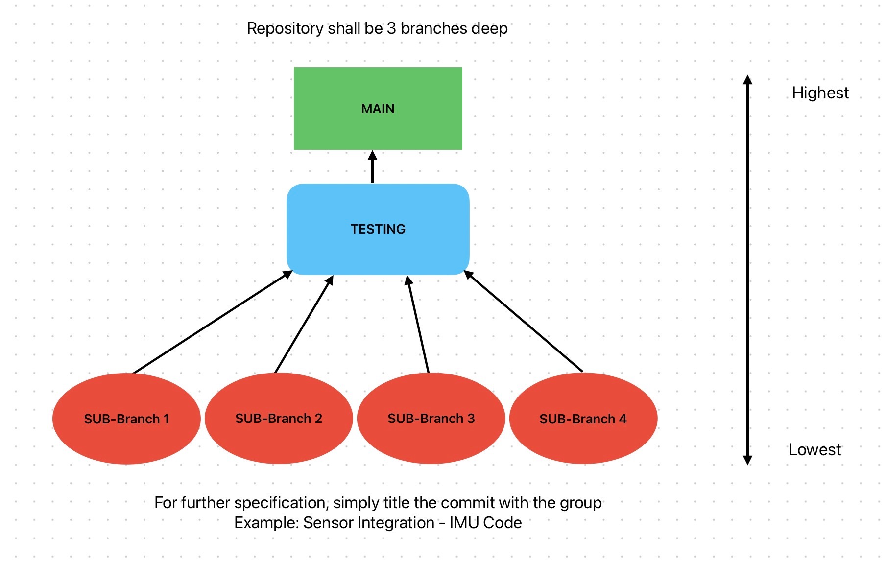

# ✈️ Fixed Wing Code

## 💻 Installation Instructions

1. Install the [PlatformIO IDE](https://marketplace.visualstudio.com/items?itemName=platformio.platformio-ide) extension in VSCode. It may take several minutes to install.
2. Clone the repository and open it in VSCode.
3. Wait for PlatformIO to initialize. Once it has initialized, run `PlatformIO: Upload` from the command palette.

## 🪾 Commit Guide

1. For each new feature you develop, checkout a new branch from the `testing` branch.
2. When the feature is complete, create a PR and merge your branch into `testing`. Build from the `testing` branch onto the teensy to ensure the code compiles and works as intended.
3. When the `testing` branch is in working order, create a PR to merge `testing` into `main`. You will require another person to review this code and approve it for production code.

## 🌐 Code Quality Guide

Rules:

1. No magic numbers -> Name all variables.
2. Minimum variable and function name size is 5 characters.
3. All functions have header comments.
4. Spaces before and after every operator.
5. Maximum line length 100 characters.
6. Name stamp all files you worked on.

## 📕 Documentation

[Code Structure Google Doc](https://docs.google.com/document/d/1Ii3o29yIFMhl5oOum0NvSB-DmLyLTfj5HldHEZTF7_Y/edit?tab=t.0) 
[Code Diagram](https://drive.google.com/file/d/1e6DcJ7m8J9z2wx--jvXQMBKPv8Ds4tnV/view?usp=drive_link) 
[Flight Time Calculation](https://drive.google.com/file/d/1WnyeDU5Te4U1FLIaFBqfFJF0_qbGJzMQ/view?usp=drive_link) 
[Radio Integration](https://drive.google.com/file/d/1g9vTinkki6MTD-Emi6HOWP1msIlG8_G7/view?usp=drive_link)

## 🛰️ MAVLink Message Discovery (Developer Notes)

When you need to find MAVLink message IDs, structs, or decode helpers:

1. Start from `#include <MAVLink.h>` and open the dependency header at:
   `.pio/libdeps/teensy41/MAVLink/MAVLink.h`
2. `MAVLink.h` includes `mavlink/common/mavlink.h`, which includes the generated message headers.
3. Use `rg` to locate the specific message name in the generated headers:
   - `rg -n "MAVLINK_MSG_ID_SET_POSITION_TARGET_GLOBAL_INT" .pio/libdeps/teensy41/MAVLink/mavlink/common`
   - `rg -n "set_attitude_target" .pio/libdeps/teensy41/MAVLink/mavlink/common`
4. The message definitions live in files like:
   - `.pio/libdeps/teensy41/MAVLink/mavlink/common/mavlink_msg_set_position_target_global_int.h`
   - `.pio/libdeps/teensy41/MAVLink/mavlink/common/mavlink_msg_set_attitude_target.h`
